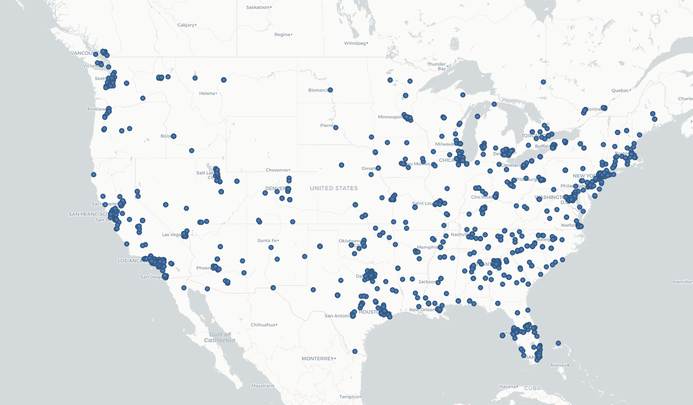
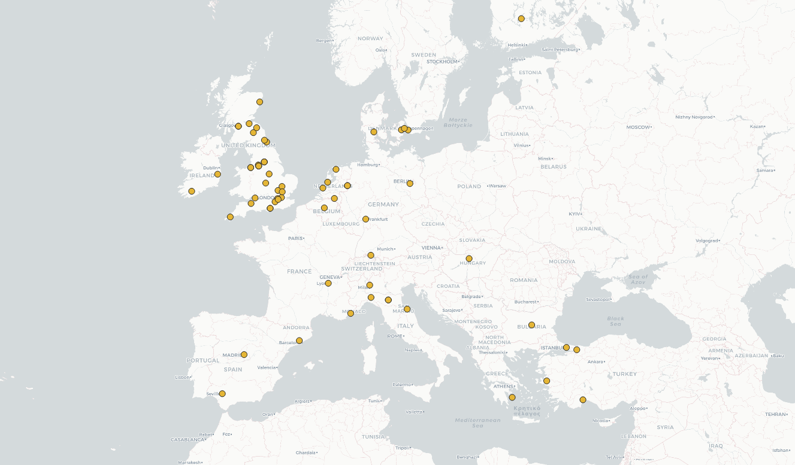
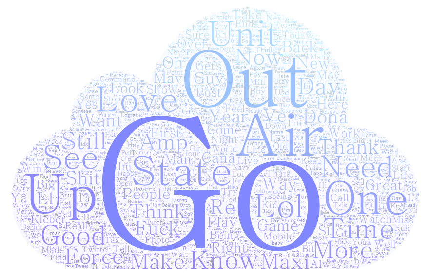
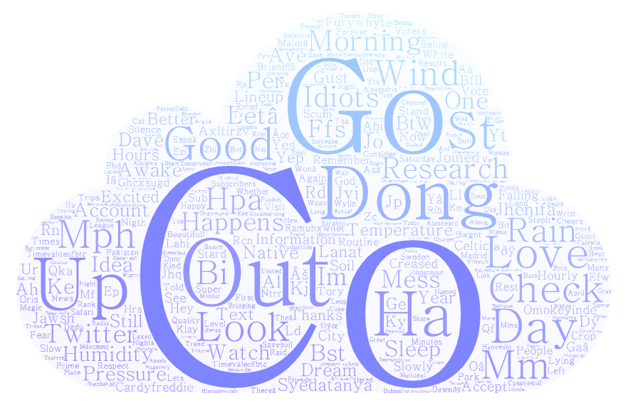

# Lab 02 Deliverable
## Introduction
In this lab, I decided to analyze the differences between tweets in the United States and Europe with the topic keyword "fake news". Since Twitter is a social network that has recently been linked to the spread of misinformation, I was curious to see where different people in the US and in Europe were having conversations about fake news. I also wanted to compare the magnitude of tweets relating to fake news in both countries. 

## Maps of Tweets in the United States and Europe

In both runs of the geosearch script, the runtime was set for 5 minutes. The map of the United States shows many tweets across the country with clusters typically found in major cities like Seattle, San Francisco, Los Angeles, Chicago, and the East Coast. In Europe we see much fewer tweets produced in the 5 minute span. Most of the tweets are located in the United Kingdom, and the rest of the tweets are spread out across Europe with no strong correlations between population size and tweets sent. There may be fewer tweets in Europe because the geosearch script was set to collect tweets in English. There may be more tweets in Europe that are in different languages and weren't collected by the script. This would also account for the higher number of tweets in the United Kingdom which has English as a predominant language. In the United States it makes sense that more tweets are coming from cities with a higher population.

## Word Clouds From American and European Tweets

### United States

### Europe

Considering there were many more tweets collected in the United States than in Europe, the word cloud for the US looks a bit more representative of what a majority of tweets would be than the word cloud for Europe. One word that contextualizes the US word cloud is the frequency of the word "State". The United States are made up of states, where as people in Europe would be less likely to use the word "State" in their tweets. "Co" being the most frequently tweeted word in Europe makes sense because many websites from the UK that are linked in tweets would have the domain URL ".co.uk". Websites in the United States typically have ".com" domains, which explains why you wouldn't see "Co" in the US as frequently as you do in Europe.